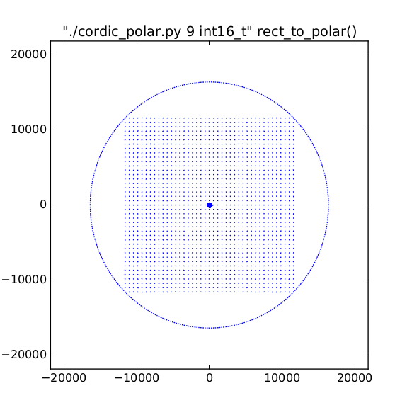

cordic_polar.py
===============

Generates polar to rectangular conversion functions using a CORDIC algorithm.

https://en.wikipedia.org/wiki/CORDIC

Fixed-point trigonometric functions for microcontrollers and microprocessors.

Usage
-----

`cordic_polar.py [-h] [--pdfname PDFNAME] passes datatype`

positional arguments:

* `passes`             number of CORDIC passes

* `datatype`           datatype (one of int8_t, int16_t, int32_t)

optional arguments:

  `-h`, `--help`       show this help message and exit

  `--pdfname PDFNAME`  Filename for error report

The code is printed to the output.

Scaling and Units
-----------------
The units are scaled to the datatype used.

The angle measure is binary radians in the size of the datatype. This fits one rotation in one wrap of the datatype.

The magnitude measure is arbitrary, but use no more than the range of the datatype / 2 to prevent internal overflows. For example, with int16_t the limit is 32768 / 2 or 16384. The x- and y- can be any value that maintains a magnitude less than this. For int16\_t safety, it's easier to keep x and y in the square bounded by +/- 16384/sqrt(2) in both dimensions.

Dependencies
------------

Requires Python 2.  If making an error plot, requires matplotlib.

To do error testing, this script compiles its output and runs the code as a subprocess.  This requires a working C compiler on the host, installed as 'cc'.

There may be portability bugs related to the temp directory. It works on Ubuntu, if that helps any.

Notes
-----

The C implementation requires arithmetic right-shift of signed integers. This is compiler-defined behavior, but GCC does what we want: "Signed ‘>>’ acts on negative numbers by sign extension." from https://gcc.gnu.org/onlinedocs/gcc/Integers-implementation.html

If you're using a compiler that does something else, define the macro ARS for arithmetic right-shift.

FAQ
===

How accurate is it?
-------------------

See the accuracy test results in comments at the top of the
generated function, or get the pdf accuracy test.

How performant is it?
---------------------

Pretty fast.

Is there a version for floating point?
--------------------------------------

No.

If you have a floating point processor, you might see if your libc has implemented the functions in a suitable way for you.  And you should be aware of the complex arithmetic built into C99. http://en.cppreference.com/w/c/numeric/complex/imaginary

What error can I expect?
------------------------

Look at the error report PDF and the error summary comment in the generated code.

Each CORDIC step adds about one bit of resolution, so if you are using 16-bit output and 5 cordic steps, you will see about 11 bits of noise (p-p), and angle resolution of about 2**5 = 32 divisions of the circle (error of 3.125% p-p).

The error report has missing dots
---------------------------------

When errors are very small, they will not show up on the error report. You can turn on markers by adding `markers='.'` to the plt.plot() arguments.

I want to use this in an embedded project, but it's GPL!
--------------------------------------------------------

Only the code itself is GPL-licensed. Its output (the generated routines) can be used however you wish.

Example error report
====================

